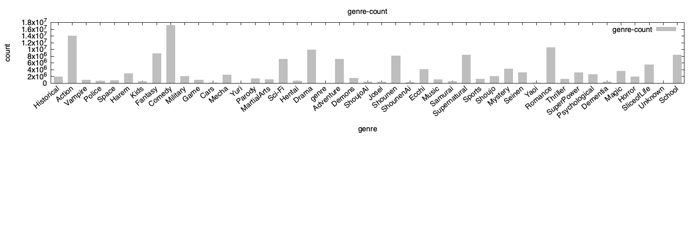
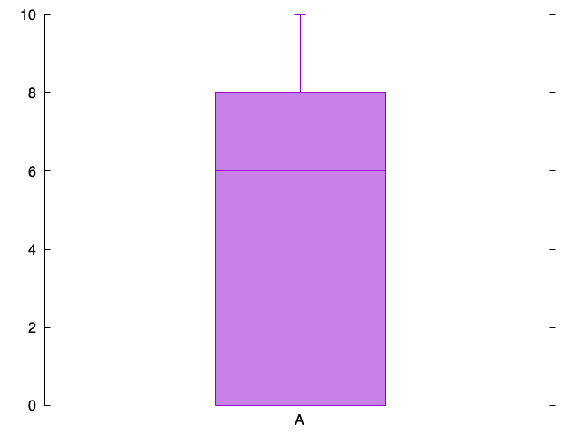

# a5 Project CS131:

## Project Objective: What genres of anime do Males and Females like the most?

### Procedure:

Clean data:  
- clean genre column in final_animedataset.csv (has commas to seperate multiple genres, which is making it harder to extract all the genres of an anime)

### Metadata of the Anime 2023 dataset:

- How many *unique users*?  
	116,125  

- *value ranges*:  
	Popularity column: 1 - 56505  
	my_score column: 0 – 10  

- *Male* and *Female* count?  
	Anonymous count: **506907**  
	Male count: **126984**  
	Female count: **96485**  
	Non-Binary count: **914**  

### Nontrivial information:
- Male and female users like **exactly** the same anime genres

##### Male top 10:  
genre,users  
Comedy,12443717  
Action,10506464  
Romance,7422955  
Drama,6718771  
Fantasy,6232419  
School,6205281  
Supernatural,5899197  
Shounen,5862779  
Sci-Fi,5428070  
Adventure,5195149  

##### Female top 10:
genre,users  
Comedy,4674081  
Action,3482950  
Drama,3104768  
Romance,3058903  
Fantasy,2477082  
Supernatural,2408702  
School,2163059  
Shounen,2134648  
Adventure,1970463  
Sci-Fi,1658090   

### 2 Plots:  
  
  
